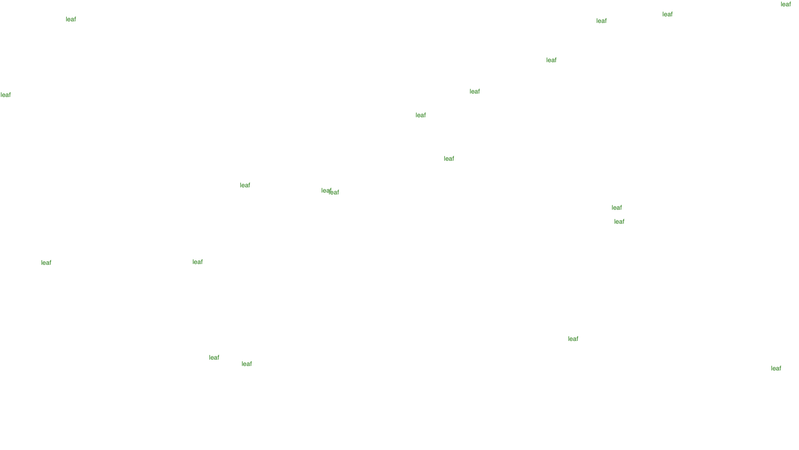
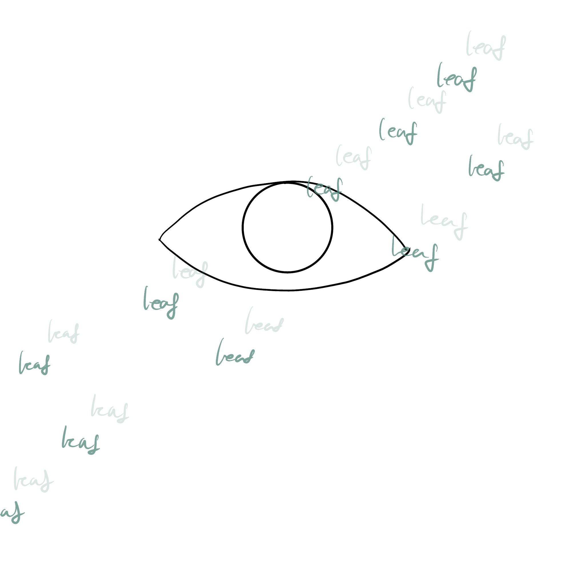
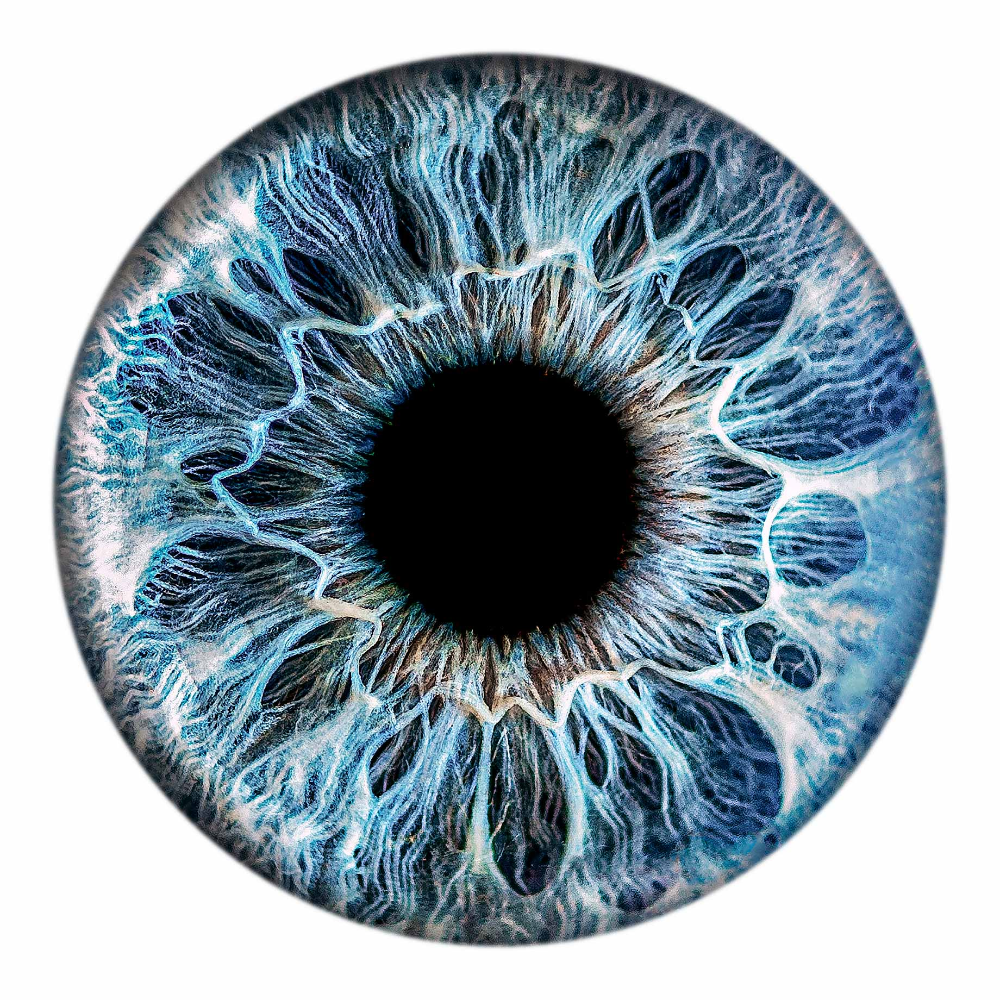
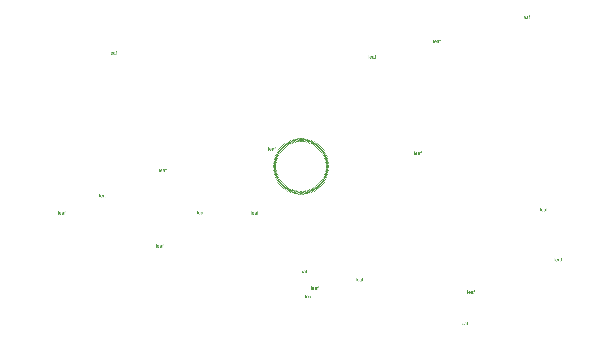
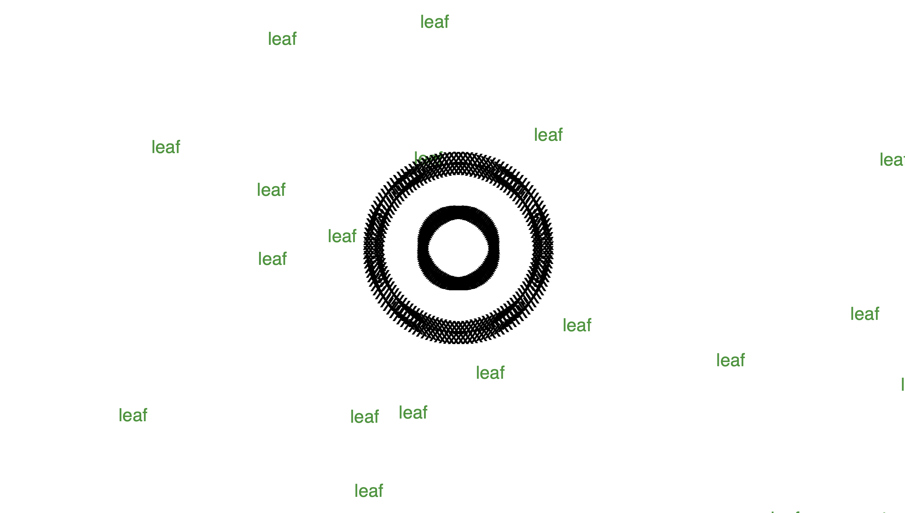
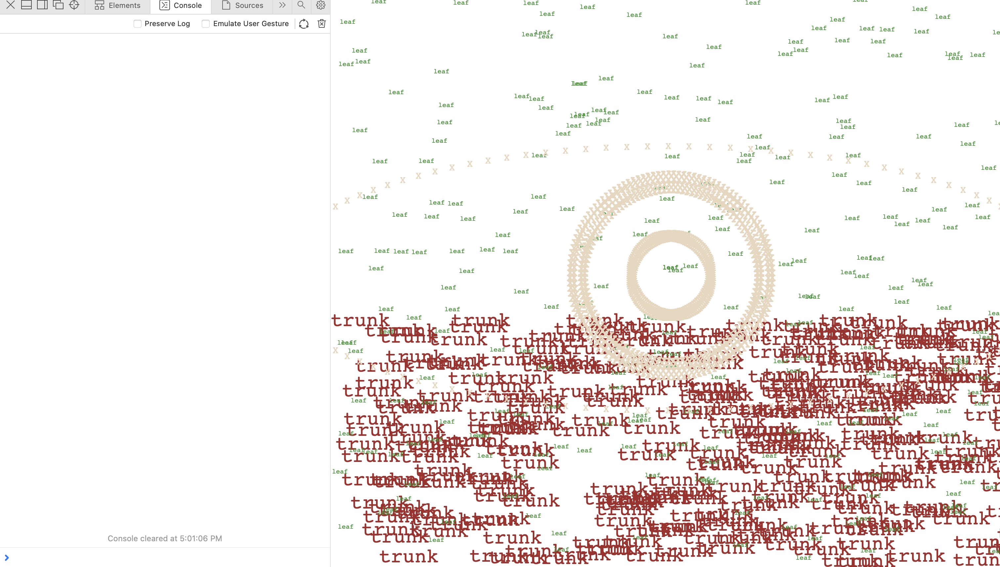

# Q & A
### Which text did you choose? Who wrote it? When? Where is it from?  
I like wind. I went to look for poems about wind, and I picked this one from Discover Poetry.com (https://discoverpoetry.com/poems/wind-poems/):   
  
**"Who Has Seen the Wind?"**
by Christina Georgina Rossetti  
  
Who has seen the wind?  
Neither I nor you:  
But when the leaves hang trembling,  
The wind is passing through.  

### How is the animation related to the text?  
There is no text indicating wind, but the leaves are floating at different speeds all the time, as if the wind is always there.  
Also, I created an eye in the middle to indicate gaze of us looking at the nature and vice versa. 

### What were some of the challenges when implementing this exercise?  
1. I want to create the leaf movements using sin() and cosine. I went to https://www.youtube.com/watch?v=qWIcAWYm-aU learn this on YouTube. It was hard for me to understand angle increment and how to relate that with sin() when writing. I had to find examples of how people use the triangle stuffs to debug. 

2. My coding abilities can only take me this far to create a still eye. I wanted it to blink somehow, but I failed to implement it. I might try to advance it in my midterm project. 

3. I don't find the image very well-made. It might be because text design are harder without shapes, but I'm sure there are people doing better then me (but there always will be). It actully took me almost a day to study and create things like angle change and building class(). 

### Include drawings and images of reference visualizations
I had this initial attempt to create a basic scene of leaves waving in the wind. I used class(), function(), and shake().

Then, I want the leaves to be more concreate.   
I drew this sketch with leaves that change its position & a eye in the bg.  

Regarding the eye, I wanted it to be wise. I used this image as a reference. 

To complete a pupil in the middle, I used sin() and angle again to create the shape made up of "X."

Double layer it is. 

#### Optimization
At one point, I thought about adding some still tree trunks. However, my leaves are so thin and the effect would not be good with loose trunks.   

